# ConfigManager Actor Migration Flow

This document captures the current `ConfigManager` control flow before moving it to an actor.
It focuses on real behavior in the current Android implementation, including startup, cache fallback,
background refresh, assignment loading, test mode, and paywall wait semantics.

## Mermaid flowchart

```mermaid
flowchart TD
    A[Caller triggers config work] --> A1{Entry point}

    A1 -->|SDK setup| B[Superwall.setup -> configManager.fetchConfiguration]
    A1 -->|config getter after Failed state| C[configManager.config getter]
    A1 -->|explicit refresh| D[Superwall.refreshConfiguration -> refreshConfiguration force=true]
    A1 -->|new app session| E[AppSessionManager.detectNewSession -> refreshConfiguration force=false]
    A1 -->|identity configure / identify| F[Identity actor -> sdkContext.fetchAssignments]
    A1 -->|paywall pipeline| G[waitForEntitlementsAndConfig]
    A1 -->|manual preload all| H0[Superwall.preloadAllPaywalls -> preloadAllPaywalls]
    A1 -->|manual preload by event names| H00[Superwall.preloadPaywalls -> preloadPaywallsByNames]

    B --> H{configState != Retrieving?}
    C --> C1{current state Failed?}
    C1 -->|yes| B
    C1 -->|no| C2[return current config or null]
    H -->|no| H1[ignore duplicate fetch]
    H -->|yes| I[fetchConfig]

    subgraph InitialFetch [Initial fetchConfig path]
        I --> J[configState = Retrieving]
        J --> K[read LatestConfig from storage]
        K --> L[read subscription status]
        L --> M[set cache timeout: 500ms if Active, else 1s]
        M --> N[launch 3 concurrent jobs]

        N --> O[Config job]
        N --> P[Enrichment job]
        N --> Q[Session device attributes job]

        O --> O1{cached config exists and enableConfigRefresh?}
        O1 -->|yes| O2[call network.getConfig under timeout]
        O1 -->|no| O3[call network.getConfig without timeout]

        O2 --> O4{network returned before timeout?}
        O4 -->|success| O5[use fresh config]
        O4 -->|failure| O6[fallback to cached config if present]
        O4 -->|timeout| O7[fallback to cached config if present, else fail]

        O3 --> O8{network success?}
        O8 -->|yes| O5
        O8 -->|no| O9[config fetch failure]

        P --> P1[read LatestEnrichment from storage]
        P1 --> P2{cached config exists and enableConfigRefresh?}
        P2 -->|yes| P3[get enrichment with cache timeout]
        P2 -->|no| P4[get enrichment with 1s timeout]
        P3 --> P5{fresh enrichment success?}
        P5 -->|yes| P6[write enrichment to storage]
        P5 -->|no| P7[fallback to cached enrichment if present]
        P4 --> P8{fresh enrichment success?}
        P8 -->|yes| P6
        P8 -->|no| P9[enrichment failure]

        Q --> Q1[build session device attributes]

        O5 --> R[await all jobs]
        O6 --> R
        O7 --> R
        O9 --> R
        P6 --> R
        P7 --> R
        P9 --> R
        Q1 --> R

        R --> S[track DeviceAttributes]
        S --> T{config result success?}
        T -->|no| U[configState = Failed]
        T -->|yes| V[track ConfigRefresh]

        U --> U1{config came from cache?}
        U1 -->|no| U2[call refreshConfiguration synchronously]
        U1 -->|yes| U3[do not call refresh here]
        U2 --> U21[refreshConfiguration reads config]
        U21 --> U22{getter sees Failed?}
        U22 -->|yes| U23[schedule fetchConfiguration side effect]
        U22 -->|no| U24[no side effect]
        U23 --> U25[refreshConfiguration returns early because config is null]
        U24 --> U25
        U25 --> U4[track ConfigFail and log]
        U3 --> U4

        V --> W[processConfig]
        W --> X{test mode active after evaluation?}
        X -->|newly activated| Y[set default test mode subscription status]
        X -->|yes| Z[launch fetchTestModeProducts]
        X -->|newly activated| ZA[launch presentTestModeModal]
        X -->|no| ZB[launch storeManager.loadPurchasedProducts]

        W --> AA[update DisableVerboseEvents storage]
        W --> AB{enableConfigRefresh?}
        AB -->|yes| AC[write LatestConfig]
        AB -->|no| AD[skip config cache write]
        W --> AE[rebuild triggersByEventName]
        W --> AF[choose paywall variants]
        W --> AG[merge entitlements from config products]

        AG --> AH{not in test mode?}
        AH -->|yes| AI[launch checkForWebEntitlements]
        AH -->|no| AJ[skip config-driven web redemption]

        AI --> AK{preloading enabled?}
        AJ --> AK
        AK -->|yes| AL[try storeManager.products for all config productIds]
        AK -->|no| AM[skip product preload]
        AL --> AN{product preload throws?}
        AN -->|yes| AO[log and continue]
        AN -->|no| AP[continue]

        AM --> AQ[configState = Retrieved]
        AO --> AQ
        AP --> AQ

        AQ --> AR{config came from cache?}
        AR -->|yes| AS[launch refreshConfiguration]
        AR -->|no| AT[no immediate config refresh]

        AQ --> AU{enrichment came from cache or failed?}
        AU -->|yes| AV[launch background enrichment retry maxRetry=6 timeout=1s]
        AU -->|no| AW[skip enrichment retry]

        AS --> AX{overall success path}
        AT --> AX
        AV --> AX
        AW --> AX
        AX --> AY[launch preloadPaywalls]
    end

    subgraph Refresh [refreshConfiguration path]
        D --> RA
        E --> RA
        AS --> RA
        U2 --> RA

        RA[refreshConfiguration force?] --> RB{current config exists?}
        RB -->|no| RC[return early, but a Failed-state getter read may already have scheduled fetchConfiguration]
        RB -->|yes| RD{force or enableConfigRefresh?}
        RD -->|no| RE[return early]
        RD -->|yes| RF[launch background enrichment refresh]
        RF --> RG[call network.getConfig]
        RG --> RH{fresh config success?}
        RH -->|yes| RI[handleConfigUpdate]
        RH -->|no| RJ[log warning only]

        RI --> RK[reset paywall request cache]
        RK --> RL{old config exists?}
        RL -->|yes| RM[remove unused paywall views from cache]
        RL -->|no| RN[continue]
        RM --> RO[processConfig]
        RN --> RO
        RO --> RP[configState = Retrieved]
        RP --> RQ[track ConfigRefresh isCached=false]
        RQ --> RR[launch preloadPaywalls]
        RR --> RS[no in-flight guard: overlapping refreshes may complete out of order]
    end

    subgraph Assignments [Assignment-related paths]
        F --> FA[getAssignments]
        FA --> FB[await first Retrieved config]
        FB --> FC{config has triggers?}
        FC -->|no| FD[return]
        FC -->|yes| FE[assignments.getAssignments from network]
        FE --> FF{network success?}
        FF -->|yes| FG[transfer assignments to disk]
        FG --> FH[launch preloadPaywalls]
        FF -->|no| FI[log retrieval error]

        W --> FJ[assignments.choosePaywallVariants]
        FJ --> FK[refresh in-memory unconfirmed assignments]

        F1[confirmAssignment] --> F2[post confirmation asynchronously]
        F2 --> F3[move assignment to confirmed storage immediately]
    end

    subgraph ManualPreload [Manual preload entrypoints]
        H0 --> MP1[await first Retrieved config]
        H00 --> MP2[await first Retrieved config]
        MP1 --> MP3[preload all paywalls]
        MP2 --> MP4[preload paywalls for event names]
        MP1 --> MP5{config never reaches Retrieved?}
        MP2 --> MP5
        MP5 -->|yes| MP6[call can suspend indefinitely]
    end

    subgraph IdentityCoupling [Identity and paywall coupling]
        B --> IA[identityManager.configure]
        IA --> IB{needs assignments?}
        IB -->|yes| FA
        IB -->|no| IC[identity ready without assignments]

        IY[identityManager.identify] --> IY1{sanitized userId valid and changed?}
        IY1 -->|no| IY2[ignore or log invalid id]
        IY1 -->|yes| IY3{was previously logged in?}
        IY3 -->|yes| IY4[completeReset on SDK]
        IY3 -->|no| IY5[keep current managers]
        IY4 --> IY6[identity state reset]
        IY5 --> IY7[identity state identify]
        IY6 --> IY7
        IY7 --> IY8[track identity alias and attributes]
        IY8 --> IY9[resolve seed after awaitConfig]
        IY8 --> IY10[redeem Existing web entitlements]
        IY8 --> IY11[reevaluate test mode on identity change]
        IY8 --> IY12{restore assignments inline?}
        IY12 -->|yes| FA
        IY12 -->|no| IY13[fire-and-forget FetchAssignments]

        G --> GA[wait up to 5s for subscription status != Unknown]
        GA --> GB{timed out?}
        GB -->|yes| GC[emit presentation timeout error]
        GB -->|no| GD[inspect configState]

        GD --> GE{state Retrieving?}
        GE -->|yes| GF[wait up to 1s for Retrieved or Failed]
        GE -->|no| GG[wait for Retrieved, or throw if state becomes Failed]
        GF --> GH{timed out after 1s?}
        GH -->|yes| GI[call configOrThrow again with no timeout]
        GH -->|no| GJ[continue]
        GI --> GJ1{state eventually Failed?}
        GJ1 -->|yes| GK[emit NoConfig presentation error]
        GJ1 -->|no| GL[may continue waiting indefinitely]
        GG --> GM{state eventually Failed?}
        GM -->|yes| GK
        GM -->|no| GN[None or Retrying can also wait indefinitely]
        GJ --> GO[awaitLatestIdentity until no pending identity resolution]
        GL --> GO
        GN --> GO
        GO --> GP{identity pending assignments/reset/seed?}
        GP -->|yes| GQ[can wait indefinitely]
        GP -->|no| GR[presentation may proceed]
    end

    subgraph TestMode [Test mode reevaluation entrypoints]
        TM1[processConfig] --> TM2[reevaluate test mode from config]
        TM3[identity changed] --> TM4[reevaluate test mode from current config]
        TM2 --> TM5{was active and no longer qualifies?}
        TM4 --> TM5
        TM5 -->|yes| TM6[clear test mode state]
        TM6 --> TM7[set subscription status Inactive]
        TM5 -->|no, newly qualifies| TM8[fetch test mode products]
        TM8 --> TM9[present test mode modal]
    end
```

## Notes that matter for the actor migration

- `fetchConfiguration()` is guarded only by `configState != Retrieving`. It does not guard against concurrent `refreshConfiguration()` calls.
- `config` getter has a side effect: reading it while state is `Failed` schedules a new fetch.
- Initial fetch is a fan-out/fan-in workflow: config, enrichment, and device attributes start concurrently, then `processConfig` triggers more side effects.
- Cached config success is a two-phase path:
  first return cached config quickly,
  then launch `refreshConfiguration()` in the background.
- Enrichment also has a two-phase path:
  quick cached fallback first,
  then background retry if enrichment was cached or failed.
- Assignment loading depends on config availability and is triggered from identity flows, not only from config flows.
- Paywall presentation currently waits on three conditions:
  subscription status resolved,
  config path not terminally failed,
  identity no longer pending.
- `refreshConfiguration()` logs on failure but does not move `configState` to `Failed`; it leaves the previous retrieved config in place.
- `processConfig()` is not pure state reduction. It writes storage, mutates trigger caches, mutates assignments, mutates entitlements, reevaluates test mode, and launches additional async work.
- Test mode transitions can change subscription status and show UI as part of config processing or identity changes.
- Manual preload APIs are external entrypoints into `ConfigManager`, and they also wait on config availability.

## Current-code caveats

- The intended `ConfigState.Retrying` path appears effectively dead today.
  `ConfigManager` passes a retry callback into `network.getConfig { ... }`, but `Network.getConfig()` does not forward that callback into `NetworkService.get()`, so retries happen without updating `configState` to `Retrying`.
- `awaitFirstValidConfig()` waits for `Retrieved` only. Callers like assignment fetch will suspend until a config arrives; they do not short-circuit on `Failed`.
- `refreshConfiguration()` requires an already available config to perform a real network refresh.
  After cold-start failure, the apparent recovery path is the `config` getter side effect scheduling a new `fetchConfiguration()`, not `refreshConfiguration()` itself succeeding.
- `waitForEntitlementsAndConfig()` only has a bounded timeout while state is exactly `Retrieving`, and even that branch can still continue waiting indefinitely afterward.
  In `None` and `Retrying`, it can wait indefinitely unless state eventually becomes `Failed`.
- `refreshConfiguration()` has no in-flight protection, so overlapping refreshes can complete out of order and overwrite newer state with older responses.
- Identity-driven web entitlement redemption is broader than the config path:
  identity changes always trigger `redeem(Existing)`, even if config-driven redemption was skipped in test mode.
- `checkForWebEntitlements()` is stronger than a read/check operation.
  It triggers redemption, can update subscription status, and can start follow-up polling behavior.

## Likely actor boundaries

- Actor state:
  `configState`, `triggersByEventName`, any in-memory assignment snapshot that should stay consistent with config, and in-flight fetch or refresh intent.
- Actor inputs:
  initial fetch, explicit refresh, session refresh, reset, identity changed, config getter retry intent, assignment refresh, preload requests.
- Actor side effects:
  network config fetch, enrichment fetch, storage writes, entitlement updates, test mode transitions, paywall preload, purchased product load, web entitlement redemption, analytics tracking.
